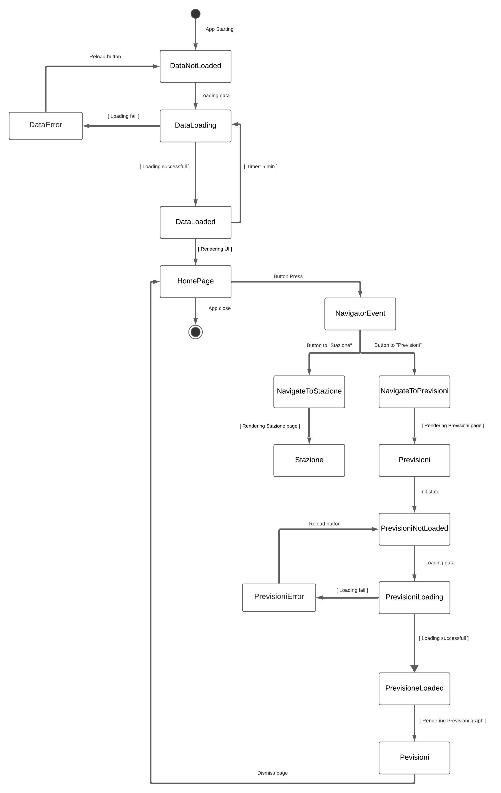

#App Maree

"App Maree" si propone come un applicazione per monitorare le varie stazione di rilevamento marea di venezia dando un riscorntro grafico e comprensibile dei dati, inoltre offre un servizio di previsione della marea nel Canal Grande

##Logica:

"App Maree" utilizza la logia del Bloc patter per gestire gli stati.

i dati sono recuperati dalle API di venezia.
Maree:  https://dati.venezia.it/sites/default/files/dataset/opendata/livello.json
Previsioni:       https://dati.venezia.it/sites/default/files/dataset/opendata/previsione.json

##DaNotare:
Per la home è stata usato il plugin 
google_maps_flutter: ^1.1.1

Per lo schema delle previsioni è stato usato il plugin
  fl_chart: ^0.12.2

Per la navigazione tra le pagine si è stata creato un Navigation bloc assesstante in modo da permettere di gestire lo spostamento tra le pagine 

      Stream<dynamic> mapEventToState(NavigationEvent event) async* {
     if(event is NavigateToPrevisioni){
      navigatorKey.currentState.push(MaterialPageRoute(builder: (context) {
                         return  Previsioni();
                        }));
    }else if(event is NavigateToStazione){
            navigatorKey.currentState.push(MaterialPageRoute(builder: (context) {
                         return  Stazione(data: event._data,);
                        }));
    }}
